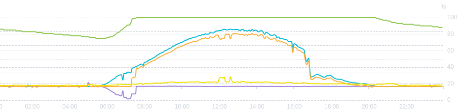
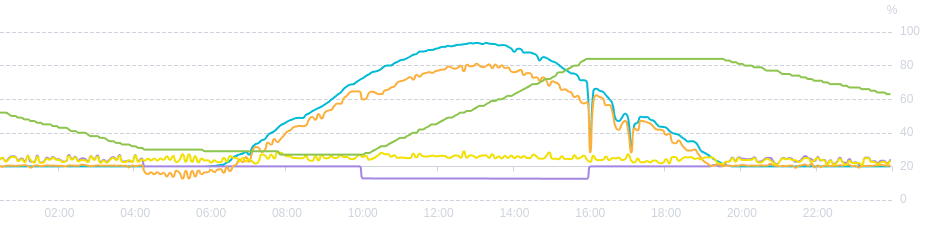

# Problem



Charging algorithms are often bad for the grid and battery.
They aggressively try to charge the battery in the morning, when energy would be needed in the grid.
Furthermore, they always charge fully, which is not good for the life time of the battery

# Goals

1. being easy on the grid and battery
2. charge battery at peak times, to better use PV modules capacity
   (e.g. if you have 30 kWp on the roof with a 20 kW inverter, up to 26 kW might be produced)

# Solution

- We start charging at a fixed time.
- We charge more slowly (for a fixed time).
- We charge to about 90%, except once a month we charge fully.



problem description, screenshots for goodwe optimizer, opensesame further work link
	fix of charge 100%

# Setup

You need a GoodWe_GW20K-ET inverter and an [Olimex MOD-RS485](https://www.olimex.com/Products/Modules/Interface/MOD-RS485/open-source-hardware) connected via Modbus-RTU.

You might need to change in the programs:

- GPIO pins according wiring
- REMOTE_ID according the modbus SLAVE_ID in goodwe settings
- capacity according to your battery's capacity
- mode of inverter must be Self-use 0x0001 (default)

default settings: baudate: 9600; Bits 8N1

## Crontab

```
# m h  dom mon dow   command
0 10 * * * /home/olimex/goodwe_battery_optimizer/set_battery_current 85
# first sunday of month to sometimes fully charge battery:
1 10 * * 7 [ $(date +\%d) -le 07 ] && /home/olimex/goodwe_battery_optimizer/write_reg 45353 200 && logger "charge to 100%"
0 16 * * * /home/olimex/goodwe_battery_optimizer/write_reg 45353 0 && logger "disable charging"
```

# Examples

```
sudo ./write_reg 47511 1  # set self-use mode
sudo ./write_reg 45353 100   # charge battery with 10 A

sudo ./read_reg 47907 1 # read current 0.1 Ampere (might not notice small currents)
sudo ./read_reg 37007 1 # read current SOC

sudo ./read_reg 35105 2 && sudo ./read_reg 35109 2 # read current Watt

sudo ./set_battery_current 80  # charge battery up to 80%
```

# Algorithm

Until 10:00 higher grid export, by:

- 00:00 - 10:00 no charging
- 10:00 - 16:00 (Summer around 12:00) (x)
- 10:00 - 14:00 (Winter around 13:00) (x)

# Measurements

Voltage: 460V .. 533.5V -> 33 Ah

# Recommendations

- ideal charging target might be 80 to 90%
- at least every 3 month you should charge up to 100%
- don't charge below 10 to 20%

# Maturity

It is in production for one PV :-)

Please open an issue if you are interested to use it.

# Next Steps

- Have an actual feedback control, to reach the target value more precisely.
- Take advantage of weather predictions.
- Integration in [opensesame](opensesame.libelektra.org).
